# Git Flow

  
<h2 style="display: inline-block">Table of Contents</h2>

  <ol>
    <li>
      <a href="#about-the-project">About The Project</a>
    </li>
    <li>
      <a href="#getting-started">Getting Started</a>
    </li>
    <li><a href="#how-it-works">How it works</a></li>
    <ol>
      <li><a href="#feature-branch">Feature Branch</a></li>
        <ul>
          <li><a href="#create-a-feature-branch">Create a feature branch</a></li>
          <li><a href="#complete-a-feature-branch">Complete a feature branch</a></li>
        </ul>
      <li><a href="#release-branch">Release Branch</a></li>
        <ul>
          <li><a href="#create-a-release-branch">Create a release branch</a></li>
          <li><a href="#complete-a-release-branch">Complete a release branch</a></li>
        </ul>
      <li><a href="#hotfix-branch">Hotfix Branch</a></li>
        <ul>
          <li><a href="#create-a-hotfix-branch">Create a hotfix branch</a></li>
          <li><a href="#complete-a-hotfix-branch">Complete a hotfix branch</a></li>
        </ul>
    </ol>
  </ol>

## About The Project
This project is to cover the usage of git flow.

## Getting started
This instructions are for macbook/linux only. To get started with git-flow, download git flow to your macbook.

`brew install git-flow`

Then download the git-flow plugin for vscode

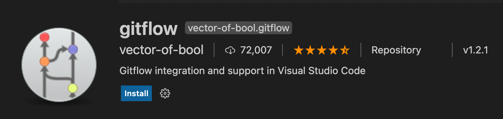

Next is to enable your project by executing `git flow init` into the terminal in your project
folder

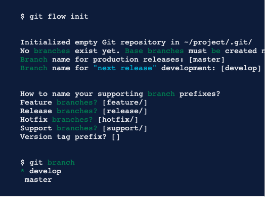

to execute git flow commands, just press `cmd+shift+p` to open quick command popup. then type
`gitflow` to see all the list of commands for git flow.

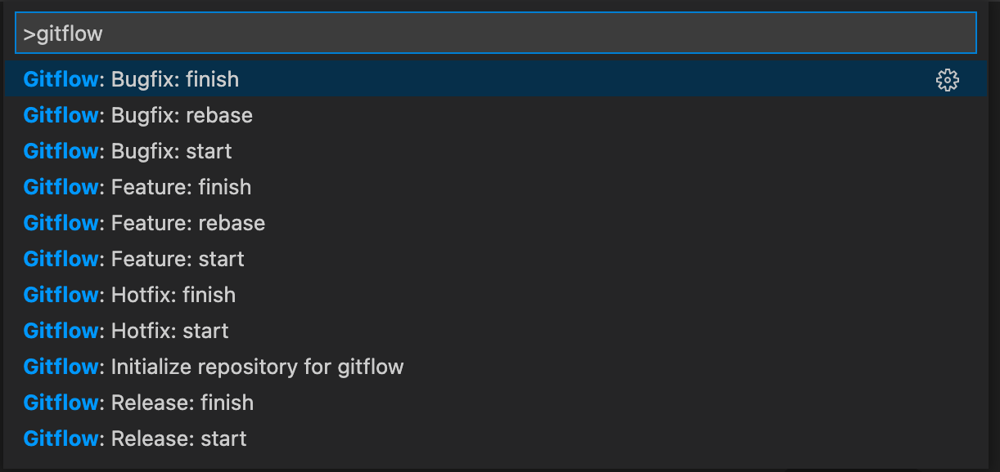

## How it works
Instead of a single master branch, the workflow uses two branches which are the master branch,
and the develop branch to record your history. The Develop branch serves as the integration
branch for all features while the master branch stores all the official releases.

## Feature Branch
Each new feature, change request or bug fix(except hotfix) should create a new feature branch
to do your code change. You should never directly modify the code in develop branch.

In the example below, we have added 2 features to our working develop branch.

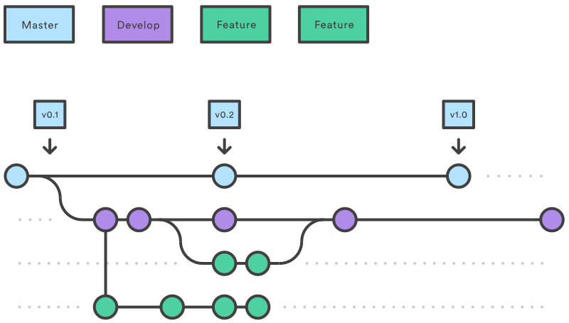

When the feature branch is completed, it will be merged back to the develop branch.
Feature branch should never be directly merged to master branch. Note that the feature
branch are generally created off the latest develop branch.

### Create a feature branch
To start a feature using vs code, open the quick command and type `gitflow: feature: start`

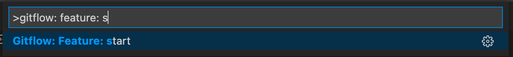

Then type in your branch name.

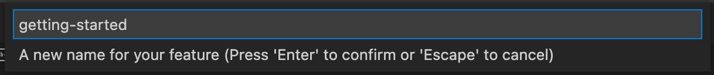

if you prefer using terminal. Then u can use the git-flow extension by typing

`git flow feature start feature_branch`

Your branch name should be short, actionable description of
what the task is about. If there's a tracker ID, then put the tracker id in front.
Follow snake case for your naming convension. `trackerid-action-description`
For example : `#001-add-user-module`

### Complete a feature branch
When a feature is completed. you can mark the feature as completed and the branch will
autometically be merged back into the develop branch. To complete a feature, in vs code,
open the quick command and type `gitflow: feature: finish`

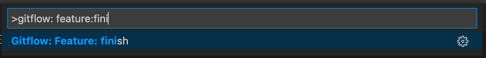

if you prefer using terminal. You can type the following:

`git flow feature finish feature_branch`

## Release Branch
The release branch is created when preparing to release a new production releases.
Another term would be to create a code freeze. So all the existing code shouldn't be change.
Only minor fixes or finishing touches are allowed. When you have finalize the release branch.
Just use the git-flow extension to set the release as finish and git-flow will automatically
help you to merge the release to the develop and master branch. It will also create a version
tag as shown in the image below.

### Create a release branch
To create a release using vs code, open the quick command and type `gitflow: release: start`

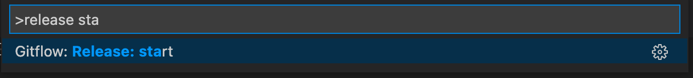

Then type in your branch name.

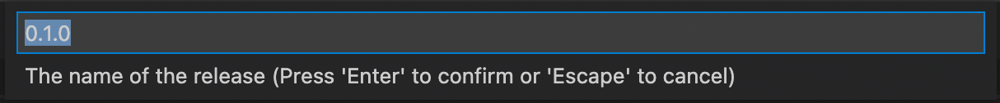

if you prefer using terminal. Then u can use the git-flow extension by typing

`git flow release start 0.1.0`

Release branhyc name should only be the version you are planning to release. this will make it
tidy and KISS

### Complete a release branch
When a release is finalized. you can mark the release as finished and the branch will
autometically be merged back into the develop and master branch. To complete a release, in vs code,
open the quick command and type `gitflow: release: finish`

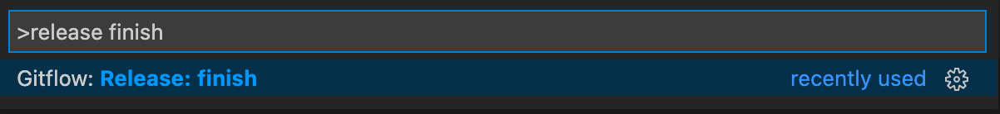

if you prefer using terminal. You can type the following:

`git flow release finish '0.1.0'`

## Hotfix Branch
The Hotfix branch is created only when there is a production issue. You should use hot fix
sparingly as this might cause merge conflicts. Hotfix branch will be created from the master
branch. After the hotfix branch is finished. Gitflow will automatically commit the hotfix to
the master and dev branch.

### Create a hotfix branch
To create a hotfix using vs code, open the quick command and type `gitflow: hotfix: start`

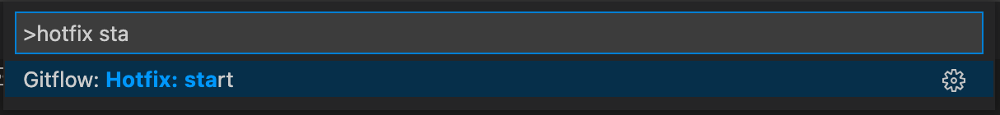

Then type in your branch name.

if you prefer using terminal. Then u can use the git-flow extension by typing

`git flow hotfix start hotfix_branch`

Hotfix branch name will follow the same naming convention as the feature branch.

### Complete a hotfix branch
When a hotfix is finalized. you can mark the hotfix as finished, and the branch will
automatically be merged back into develop and master branch. To complete a hotfix, in vs code,
open the quick command and type `gitflow: hotfix: finish`

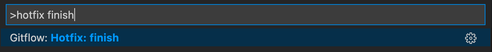

if you prefer using terminal. You can type the following:

`git flow hotfix finish hotfix_branch`
